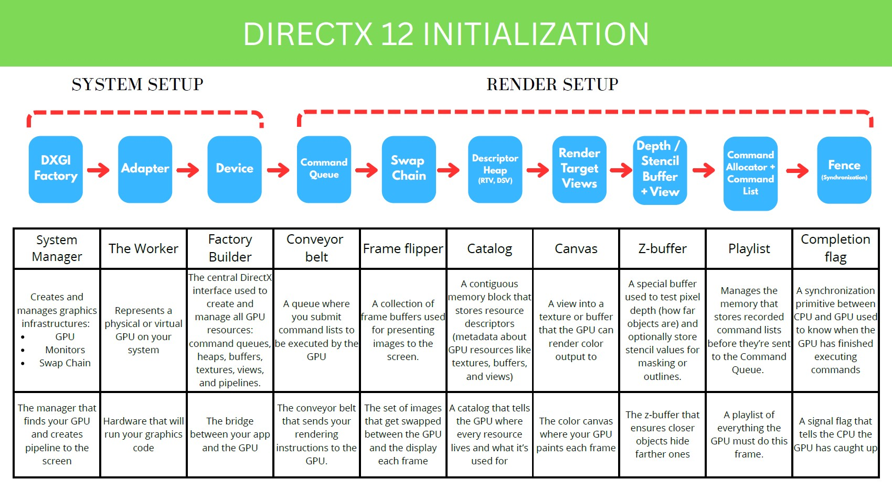
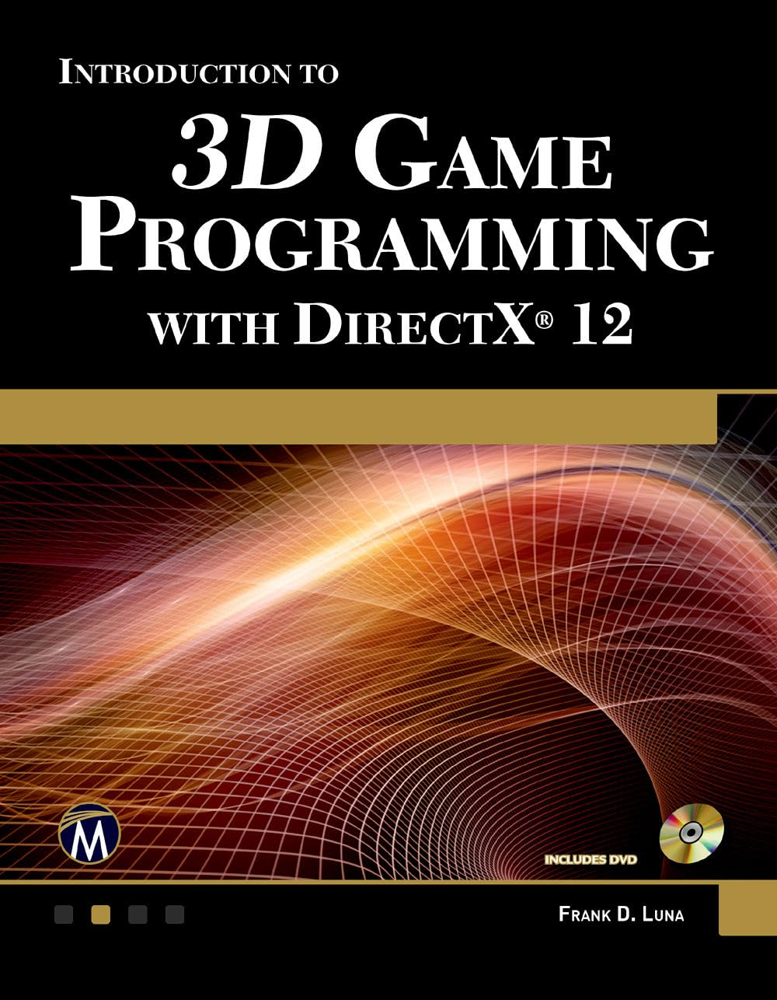
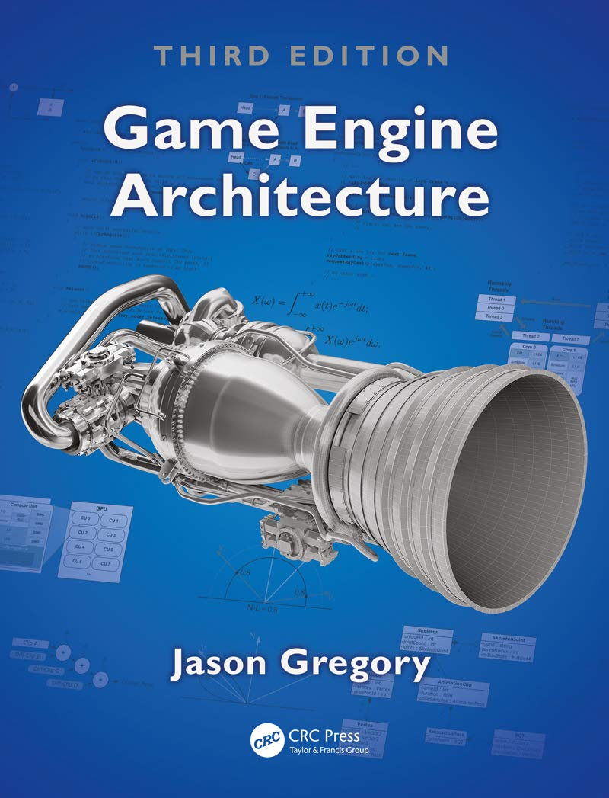

# UPC Engine

The **UPC Engine** is a DirectX 12 learning project provided by the **Universitat Politècnica de Catalunya (UPC)** as part of the *Advanced Programming for AAA Video Games* Master's degree.

---
<!--
## 🗓️ Week 1 & 2 — DirectX 12 Initialization

The goal during the first weeks was to understand the **DirectX 12 initialization pipeline** through the implementation of the `D3D12Module` class and **render a plain color on the screen**.

  

---

🚧 **Development in progress.**  
More updates coming soon.

---

### ⚠️ Disclaimer

All images and visual materials included in this repository have been produced by myself for learning purposes.  
Since this project is part of my ongoing study of DirectX 12 and graphics programming, some implementations or visual outputs may contain errors or inaccuracies.

---

My learning process is also supported by *Frank D. Luna’s* **“Introduction to 3D Game Programming with DirectX 12”** and *Jason Gregory’s* **“Game Engine Architecture.”**

  
  

-->
